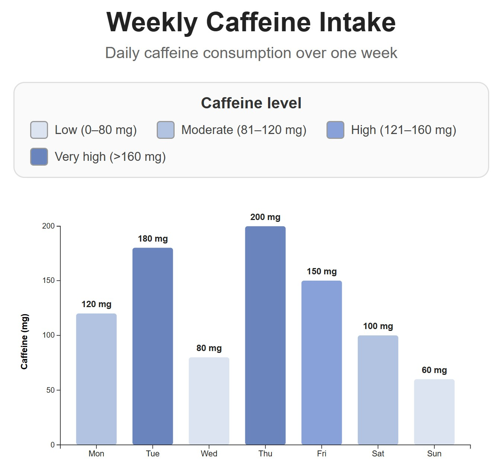
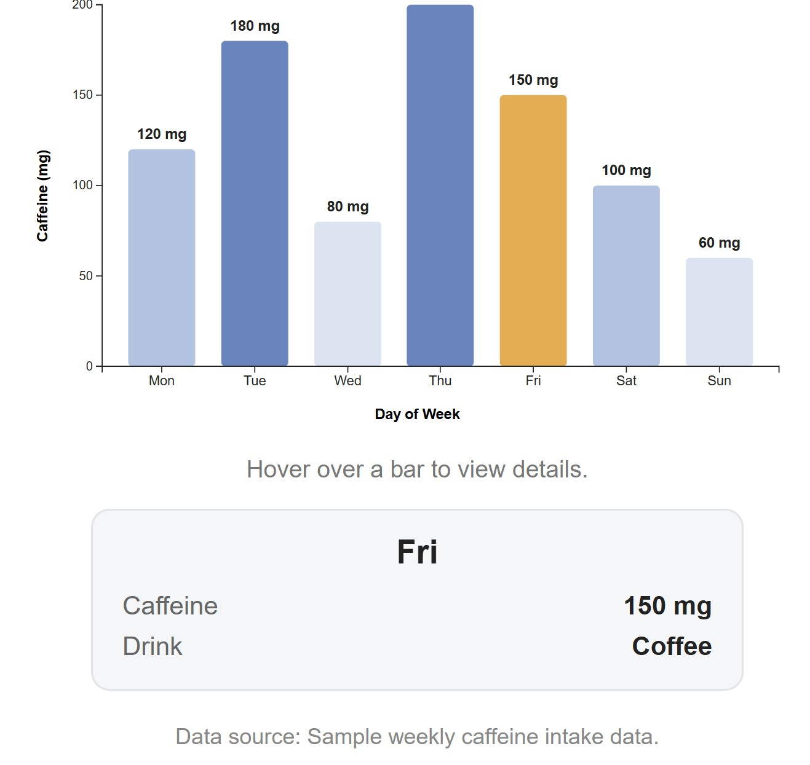

# 1151VIS HW1 - Static Visualization using D3.js

## Project Title

**Weekly Caffeine Intake**

---

## 專案說明 Project Description

本專案使用 **D3.js** 製作一個「每週咖啡因攝取量」的資料視覺化圖表。

透過 **Bar Chart 長條圖** 呈現星期一到星期日每天的咖啡因攝取量，並使用不同深淺的藍色區分不同的 caffeine intake level。

圖表另外加入簡單的 **Hover Interaction**。當滑鼠移到某一個 bar 上時，該長條會變成橘色，並顯示：

- Day
- Caffeine intake
- Drink type

本專案以 **Static Visualization** 為主，互動功能則用來補充詳細資訊，讓圖表更容易閱讀與理解。

---

## 專案目的 Project Objective

本專案的目的，是練習使用 **D3.js** 將資料轉換成視覺化圖表，並理解不同 visual encoding 如何幫助使用者閱讀資料。

本次主要練習內容包括：

- 使用長條高度表示 caffeine intake
- 使用 X-axis 呈現 day of week
- 使用 Y-axis 呈現 caffeine value
- 使用 color encoding 區分咖啡因攝取程度
- 在 bar 上方加入 value label
- 使用 legend 說明顏色的意義
- 使用 hover interaction 顯示詳細資料

透過這些設計，可以讓使用者快速比較每天的咖啡因攝取差異，也能查看個別日期的詳細資訊。

---

## Dataset 資料內容

本專案使用 7 筆資料，分別代表 Monday 到 Sunday 的咖啡因攝取量。
每筆資料包含：

- `day`：星期
- `caffeine`：咖啡因攝取量（mg）
- `drink`：當天飲品種類

```javascript
const data = [
  { day: 'Mon', caffeine: 120, drink: 'Coffee' },
  { day: 'Tue', caffeine: 180, drink: 'Coffee + Matcha' },
  { day: 'Wed', caffeine: 80, drink: 'Matcha' },
  { day: 'Thu', caffeine: 200, drink: 'Coffee + Matcha' },
  { day: 'Fri', caffeine: 150, drink: 'Coffee' },
  { day: 'Sat', caffeine: 100, drink: 'Matcha' },
  { day: 'Sun', caffeine: 60, drink: 'Tea' }
];
```

## Visualization Design 視覺化設計
### Chart Type
Bar Chart
使用長條圖比較每天的咖啡因攝取量。

### X-Axis
X 軸表示：Day of Week
包含：
Mon / Tue / Wed / Thu / Fri / Sat / Sun

### Y-Axis
Y 軸表示：Caffeine (mg)

### Value Labels
每根 bar 上方直接顯示實際 caffeine value，例如：
120 mg、180 mg、80 mg、200 mg
使用者可以直接讀取每根 bar 上方的數值，不需要只依靠 Y-axis 進行估算。

### Color Encoding 顏色編碼
本專案使用不同深淺的藍色表示不同 caffeine level。
| Caffeine Level | Range |
|---|---:|
| Low | 0–80 mg |
| Moderate | 81–120 mg |
| High | 121–160 mg |
| Very High | >160 mg |

顏色越深，代表 caffeine intake 越高。
圖表上方也加入 Legend，讓使用者可以快速理解不同顏色所代表的意義。

## D3.js Development Process 製作流程
1. 建立 Vue + Vite Project
使用 StackBlitz 建立 Vue + Vite 專案。
接著在 Terminal 安裝 D3.js：
```bash
npm install d3
```

2. Import D3.js
在 Vue component 中匯入 D3.js：
```javascript
import * as d3 from 'd3';
```
同時使用 Vue 的：
```javascript
import { ref, onMounted } from 'vue';
```
其中：
- ref() 用來取得 SVG element
- onMounted() 確保 SVG 建立完成後，再執行 D3 drawing
3. 建立 SVG
在 Vue template 中建立：
```html
<svg ref="chart"></svg>
```
接著在 onMounted() 中使用 D3 選取 SVG：
```javascript
const svg = d3
  .select(chart.value)
  .attr('viewBox', `0 0 ${width} ${height}`)
  .attr('preserveAspectRatio', 'xMidYMid meet');
```
使用 viewBox 可以讓圖表根據畫面寬度自動縮放。

4. 建立 X Scale
因為 X 軸是星期，屬於 categorical data，因此使用：
d3.scaleBand()

```javascript
const x = d3
  .scaleBand()
  .domain(data.map((d) => d.day))
  .range([margin.left, width - margin.right])
  .padding(0.28);
```

5. 建立 Y Scale
Caffeine intake 是 quantitative data，因此使用：
d3.scaleLinear()

```javascript
const y = d3
  .scaleLinear()
  .domain([0, d3.max(data, (d) => d.caffeine)])
  .nice()
  .range([height - margin.bottom, margin.top]);
```

6. Draw Bars
使用 SVG <rect> 產生每一根 bar：
```javascript
svg
  .selectAll('.bar')
  .data(data)
  .join('rect')
  .attr('class', 'bar')
  .attr('x', (d) => x(d.day))
  .attr('y', (d) => y(d.caffeine))
  .attr('width', x.bandwidth())
  .attr('height', (d) => y(0) - y(d.caffeine));
```

每根 bar 的高度由 caffeine value 決定。

7. 加入 Color Encoding
根據 caffeine intake 決定 bar color：
```javascript
function getBarColor(value) {
  if (value <= 80) return '#d9e4f2';
  if (value <= 120) return '#aac4e4';
  if (value <= 160) return '#7fa2dd';

  return '#5f86c2';
}
```

8. Draw Axes
X-axis：
```javascript
d3.axisBottom(x)
```

Y-axis：
```javascript
d3.axisLeft(y)
```

並加入：
X-axis label: Day of Week
Y-axis label: Caffeine (mg)

9. Add Value Labels
使用 SVG <text> 顯示每根 bar 的實際數值：
```javascript
svg
  .selectAll('.value-label')
  .data(data)
  .join('text')
  .attr('x', (d) => x(d.day) + x.bandwidth() / 2)
  .attr('y', (d) => y(d.caffeine) - 10)
  .attr('text-anchor', 'middle')
  .text((d) => `${d.caffeine} mg`);
```

## Interaction 互動功能
雖然本專案以 Static Visualization 為主，但另外加入簡單的 hover interaction。
當滑鼠移到某一根 bar 上時：
1. 該 bar 會變成橘色
2. 顯示目前選擇的 day
3. 顯示 caffeine intake
4. 顯示 drink type
例如：
```text
Thu

Caffeine: 200 mg
Drink: Coffee + Matcha
```

### Mouse over
```javascript
.on('mouseover', function (event, d) {
  d3.select(this)
    .attr('fill', '#f2aa3b');

  selectedData.value = d;
})
```
### Mouse out
```javascript
.on('mouseout', function (event, d) {
  d3.select(this)
    .attr('fill', getBarColor(d.caffeine));

  selectedData.value = null;
});
```
當滑鼠離開 bar 後，顏色會恢復原本的 caffeine level color。

## 操作方式 How to Use
1. 開啟專案網頁
2. 查看 Monday 至 Sunday 的 caffeine intake bar chart
3. 透過 Legend 判斷不同 bar color 所代表的 caffeine level
4. 將滑鼠移到任一 bar 上
5. 被選到的 bar 會變成橘色
6. 圖表下方會顯示該天的詳細資料
頁面也有提示：
Hover over a bar to view details.

## Project Structure 專案結構
```text
src/
├── components/
│   └── CaffeineChart.vue
├── App.vue
├── main.js
└── style.css

package.json
package-lock.json
README.md
.gitignore
```

## Screenshot 專案截圖
### 1. Main Visualization 主畫面



### 2. Hover Interaction 互動畫面


這張截圖可以呈現：
- selected bar 變成橘色
- day
- caffeine value
- drink type

## GitHub Repository
Repository URL：
https://github.com/mitesoro1231/1151VIS-HW1-410262690-YushuanChen

## Summary 總結
本專案使用 D3.js 將一週的 caffeine intake 資料轉換成 Bar Chart。
圖表透過以下 visual elements 傳達資料：
- Position
- Bar height
- Color
- Value label
- Axis
- Legend
此外，也加入 Hover Interaction，讓使用者可以查看每天更詳細的 caffeine intake 與 drink information。
